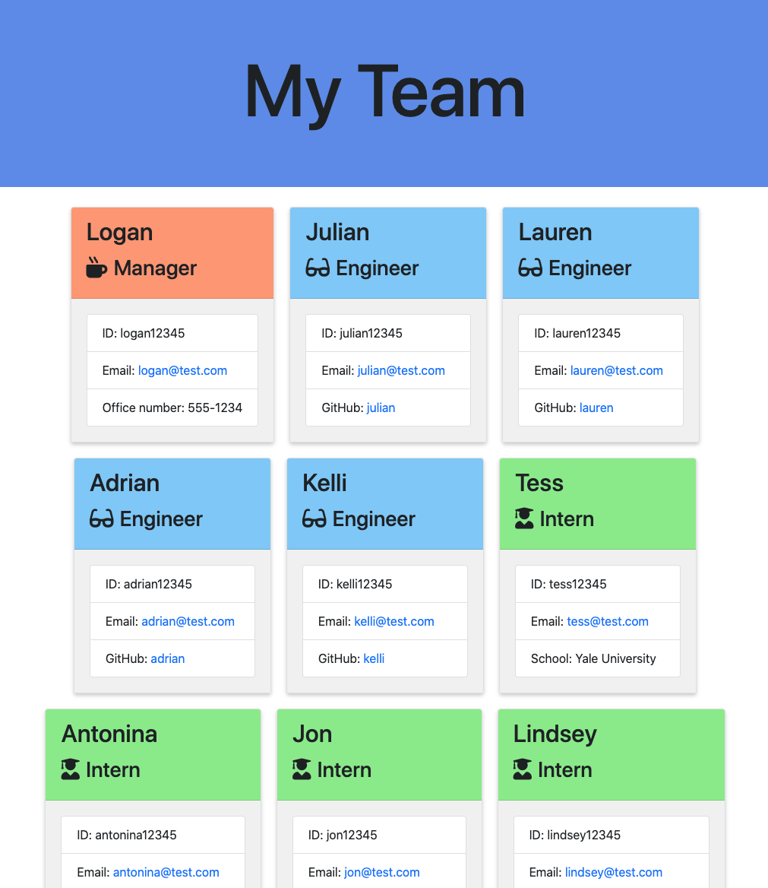
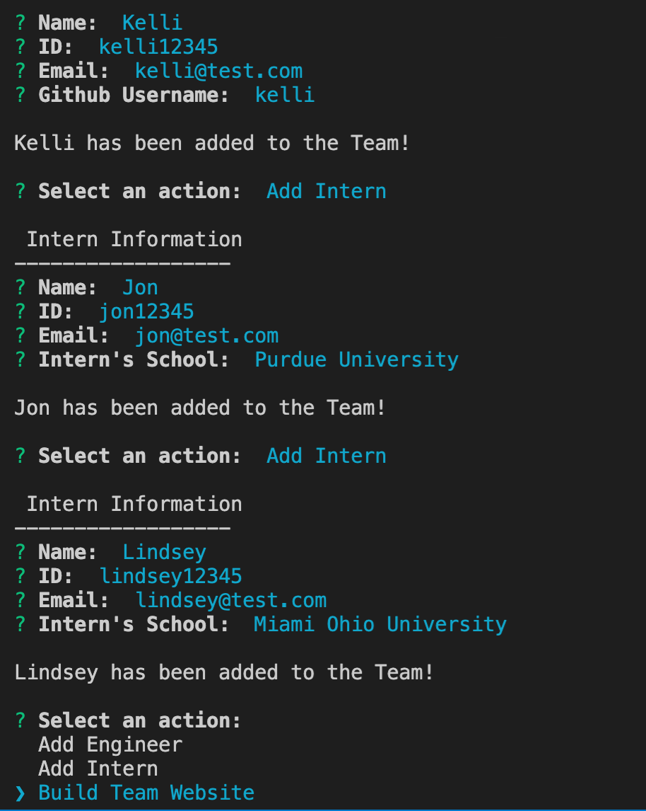

# Employee Summary (CLI)

## Table of Contents (Optional)
* [Description](#Description)
* [Installation](#Installation)
* [Instructions](#Instructions)
* [Questions](#Questions)
* [License](#License)

---

## Description

The Employee Summary application is a CLI (Command Line Interface) that helps the user generate an .html file that displays a team of: a manager, interns and engineers.

---

## Installation

1. Clone the repository from github
1. Make sure [Node.js](https://nodejs.org/en/) is installed on your computer
1. Install all Node modules by typing `npm install` in the console

---

## Instructions
Follow the video demo [here](https://drive.google.com/file/d/10NzRe6NUy-638XKx3B6cWcqqpe8lpIPl/view) for a walkthrough!

### Running the application
1. Type `node app.js` in the console of your IDE
2. Follow the prompts in the console. You will first be asked to fill out the Manager's information.
3. Continue following prompts and add as many interns and/or engineers to the team as you would like.
4. Once you've added all of your team members, choose "Build Team Website" in the prompt to generate your team.html file.
5. Once "Website html file genrated successfully..." is printed in the console, open the `team.html` file in the output folder.

---

## Questions

* My github: https://github.com/zehrl
* Email me at zehrl315@outlook.com if you have any questions.

---

## License

Copyright 2020 Logan J. Zehr

Permission is hereby granted, free of charge, to any person obtaining a copy of this software and associated documentation files (the "Software"), to deal in the Software without restriction, including without limitation the rights to use, copy, modify, merge, publish, distribute, sublicense, and/or sell copies of the Software, and to permit persons to whom the Software is furnished to do so, subject to the following conditions:

The above copyright notice and this permission notice shall be included in all copies or substantial portions of the Software.

THE SOFTWARE IS PROVIDED "AS IS", WITHOUT WARRANTY OF ANY KIND, EXPRESS OR IMPLIED, INCLUDING BUT NOT LIMITED TO THE WARRANTIES OF MERCHANTABILITY, FITNESS FOR A PARTICULAR PURPOSE AND NONINFRINGEMENT. IN NO EVENT SHALL THE AUTHORS OR COPYRIGHT HOLDERS BE LIABLE FOR ANY CLAIM, DAMAGES OR OTHER LIABILITY, WHETHER IN AN ACTION OF CONTRACT, TORT OR OTHERWISE, ARISING FROM, OUT OF OR IN CONNECTION WITH THE SOFTWARE OR THE USE OR OTHER DEALINGS IN THE SOFTWARE.